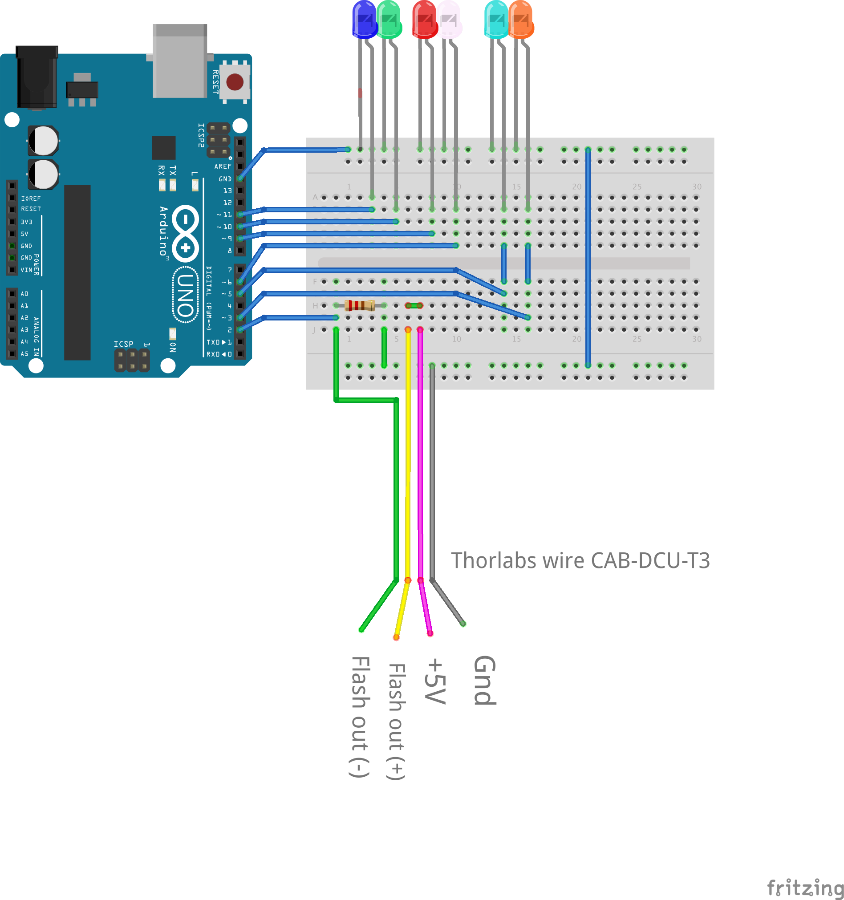

# Temporal Super-Resolution Microscopy Using a Hue-Encoded Shutter
## OSA Biomedical Optics Express Vol XXXX 2019
**Authors of the paper**:

- [Christian Jaques](mailto:christian.jaques@idiap.ch), [Idiap](https://www.idiap.ch), [EPFL](https://www.epfl.ch): [personnal page at Idiap](https://www.idiap.ch/~cjaques). Do not hesitate to [contact me](mailto:christian.jaques@idiap.ch).
- Emmanuel Pignat, [Idiap](https://www.idiap.ch), [EPFL](https://www.epfl.ch): [personnal page at Idiap](https://www.idiap.ch/~epignat)
- Sylvain Calinon, [Idiap](https://www.idiap.ch), [EPFL](https://www.epfl.ch): [personnal page at Idiap](https://www.idiap.ch/~scalinon)
- Michael Liebling, [Idiap](https://www.idiap.ch), [UCSB](https://www.ucsb.edu/) : [personnal page at Idiap](https://www.idiap.ch/~mliebling)

## Summary
This repository holds the code and instruction to reproduce the method presented in the paper entitled *Temporal Super-Resolution Microscopy Using a Hue-Encoded Shutter*.
 

There are three main parts to the repository: (1) code and instructions related to data acquisition (`acquisition` folder), (2) post-acquisition processing code (`processing` folder) and (3) the data acquired to make the figures in the paper (`data` folder). 

After setting up the physical system, see `readme` files within each folder for respective instructions.

### Supported platforms
These instructions are meant for Debian distributions of Linux (tested on Debian Stretch (4.9) and Ubuntu 16.04 LTS). The data processing should work on all platforms. The data acquisition should work on Windows (the wrapping of the `C++` code can be tricky), for macosX, the required `ueye` library isn't available. 
If anyone has a way to drive a Thorcam USB3 camera on macosX, please [let me know](mailto:christian.jaques@idiap.ch).

## System setup

### Installation

The repository includes a submodule with the data, so to retrieve everything, you have to run 

```bash 
git clone --recursive git@gitlab.idiap.ch:cjaques/hesm_distrib.git
```

or if you have cloned the repository without the submodules, from within the repo, run 

```bash
git submodule init
git submodule update
```

### Physical setup - wiring
We used the [Thorlabs DCC3240C camera](https://www.thorlabs.com/thorproduct.cfm?partnumber=DCC3240C) with the corresponding trigger/IO cable ([CAB-DCU-T3](https://www.thorlabs.com/thorproduct.cfm?partnumber=CAB-DCU-T3)). 
Wire the camera, the Arduino Uno and the LEDs together as shown here:



### Software requirements
#### Data acquisition 
To modify the Arduino code, compile it and upload it to the board (we used [Arduino uno boards](https://store.arduino.cc/arduino-uno-rev3)), you need to install the [Arduino IDE](https://www.arduino.cc/en/Main/Software).

**You need to compile the camera driver for `Python`**, to that end, run the following commands from within the `acquisition/Thorcam/` folder:

```bash
sudo apt-get install ueye
python setup.py build_ext --inplace
```
This will install `ueye` and compile a `Python` wrapper for the `C++` code to drive the Thorlabs camera.
The wrapper only works for `Python2.7` and hasn't been translated to `Python3` (see [why](https://docs.python.org/3/howto/cporting.html)). 

*Note for Windows users* : instead of `setup.py`, use `setup_windows.py`.

#### Data processing
The code needs Jupyter notebook to be run. [See here](https://jupyter.readthedocs.io/en/latest/install.html) for installation instructions.
Because of the data acquisition code, the processing code is in `Python2.7` but should work with no modification with `Python3`.

Here is how to install the required python packages.

```Python
pip install numpy matplotlib colour_demosaicing tifffile pyqtgraph
```

The package `pyqtgraph` can be tricky/tenuous to install, if you can't or just don't want, it is easy to work without it; you will just have to select regions of interest "by hand".

## License
We have a patent on the method presented in the paper, under the ***European Patent application number EP19154253***. 

Henceforth, the files distributed here are **for non-commercial use only**, see [the license file](./LICENSE.md) within this repository. 
If you have a commercial interest in the present code, please contact our [technology transfer office](mailto:tto@idiap.ch).


